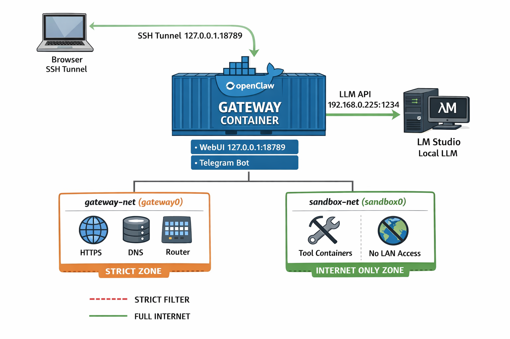

# ⚠️ Working Document – Disclaimer

This documentation is a **working document** based on the current knowledge and behavior of OpenClaw at the time of writing.  
OpenClaw is under active development, and configuration options, features, and recommended practices may change in future versions.

This document therefore describes the **current reference implementation** and does not guarantee compatibility with future OpenClaw releases.

---

# OpenClaw Secure Gateway – VM Reference Setup

## 1. Overview

### Architecture Diagram



This document describes a secure and reproducible reference architecture for running OpenClaw inside a virtual machine:

- Strict network segmentation (Gateway vs. Tool Sandboxes)
- Local LLM integration (e.g. LM Studio or any OpenAI-compatible server)
- Web UI only accessible locally
- Optional Telegram integration
- Tools can access the Internet (POST/PUT/APIs allowed)
- Tools are **blocked from accessing private LAN networks**

High-level architecture:

```
[ Browser ]
    │ SSH Tunnel
    ▼
[ OpenClaw Gateway Container ] --LLM--> [ Local LLM Server (e.g. 192.168.1.50:1234) ]
        │
        ├── gateway-net (gateway0)  -> strict firewall rules
        └── sandbox-net (sandbox0)  -> Internet only, no LAN
```

---

## 2. Virtual Machine Setup (e.g. Proxmox)

Recommended VM settings:

| Setting | Recommendation |
|--------|----------------|
| BIOS | OVMF (UEFI) |
| Machine Type | q35 |
| Guest Agent | Enabled |
| CPU Type | Host |
| Disk | VirtIO SCSI |
| Network | VirtIO |
| OS | Ubuntu Server 24.04 LTS |
| IP | Example: `192.168.1.100` |

### Why these settings?

- **UEFI + q35** provide modern virtual hardware
- **VirtIO drivers** give best I/O performance
- **Static IP** is required for firewall rules and LLM connectivity
- **Guest Agent** improves VM management and monitoring

---

## 3. Prepare Ubuntu

Update the system and install base tools:

```bash
sudo apt update && sudo apt upgrade -y
sudo apt install -y curl ca-certificates gnupg lsb-release nftables git
```

### Configure static IP (Netplan)

Example file: `/etc/netplan/01-netcfg.yaml`

```yaml
network:
  version: 2
  renderer: networkd
  ethernets:
    ens18:
      addresses:
        - 192.168.1.100/24
      gateway4: 192.168.1.1
      nameservers:
        addresses: [192.168.1.1]
```

Apply configuration:

```bash
sudo netplan apply
```

**Why static IP?**
- Firewall rules rely on predictable routing
- LLM server access should not break after reboot

---

## 4. Install Docker

```bash
curl -fsSL https://get.docker.com | sudo sh
sudo usermod -aG docker $USER
newgrp docker
```

**Why Docker?**
- OpenClaw Gateway runs as a container
- Tool sandboxes are isolated containers
- Easy upgrades and reproducibility

---

## 5. Create Docker Networks

```bash
docker network create --driver bridge --opt com.docker.network.bridge.name=gateway0 gateway-net
docker network create --driver bridge --opt com.docker.network.bridge.name=sandbox0 sandbox-net
```

**Why separate networks?**
- `gateway-net` → used by OpenClaw Gateway
- `sandbox-net` → used by tool execution containers
- Firewall rules can distinguish between them

---

## 6. Firewall (nftables)

File: `/etc/nftables.conf`

```nft
#!/usr/sbin/nft -f

add table inet oc_filter
flush table inet oc_filter

define GW_IF          = "gateway0"
define SBX_IF         = "sandbox0"

define LAN_GW_IP      = 192.168.1.1
define LLM_IP         = 192.168.1.50
define LLM_PORT       = 1234

table inet oc_filter {

  set private_v4 {
    type ipv4_addr
    flags interval
    elements = { 10.0.0.0/8,172.16.0.0/12,192.168.0.0/16,169.254.0.0/16 }
  }

  set private_v6 {
    type ipv6_addr
    flags interval
    elements = { fc00::/7, fe80::/10 }
  }

  chain input {
    type filter hook input priority 0; policy drop;
    ct state established,related accept
    iif "lo" accept
    ip protocol icmp accept
    ip6 nexthdr icmpv6 accept
    tcp dport 22 accept
  }

  chain forward {
    type filter hook forward priority 0; policy drop;
    ct state established,related accept

    iifname $GW_IF oifname $GW_IF accept
    iifname $SBX_IF oifname $SBX_IF accept

    # Sandbox: allow Internet, block private networks
    iifname $SBX_IF ip daddr @private_v4 drop
    iifname $SBX_IF ip6 daddr @private_v6 drop
    iifname $SBX_IF ip daddr 224.0.0.0/4 drop
    iifname $SBX_IF ip6 daddr ff00::/8 drop
    iifname $SBX_IF accept

    # Gateway: strict policy
    iifname $GW_IF ip daddr $LAN_GW_IP udp dport 53 accept
    iifname $GW_IF ip daddr $LAN_GW_IP tcp dport 53 accept
    iifname $GW_IF ip daddr $LLM_IP tcp dport $LLM_PORT accept
    iifname $GW_IF ip daddr @private_v4 drop
    iifname $GW_IF ip6 daddr @private_v6 drop
    iifname $GW_IF tcp dport 443 accept
    iifname $GW_IF tcp dport 80 accept
  }

  chain output {
    type filter hook output priority 0; policy accept;
  }
}
```

Enable firewall:

```bash
sudo systemctl enable nftables
sudo systemctl restart nftables
```

---

## 7. Install OpenClaw

```bash
cd /opt
git clone https://github.com/openclaw-ai/openclaw.git
cd openclaw
./docker-setup.sh
```

This script:
- Builds the gateway image
- Generates environment config
- Starts Docker services

---

## 8. Docker Compose Override

File: `/opt/openclaw/docker-compose.override.yml`

```yaml
services:
  openclaw-gateway:
    ports:
      - "127.0.0.1:${OPENCLAW_GATEWAY_PORT:-18789}:18789"
      - "127.0.0.1:${OPENCLAW_BRIDGE_PORT:-18790}:18790"
    networks:
      - gateway-net

  openclaw-cli:
    networks:
      - gateway-net

networks:
  gateway-net:
    external: true
```

**Why bind to 127.0.0.1?**
- Web UI is not exposed to LAN
- Access only via SSH tunnel

---

## 9. Pairing & Web UI

Generate token:

```bash
docker compose run --rm openclaw-cli onboard
```

Create SSH tunnel:

```bash
ssh -L 18789:127.0.0.1:18789 user@VM_IP
```

Open in browser:

```
http://localhost:18789/?token=YOUR_TOKEN
```

Optional relaxed auth (local only):

```bash
docker compose run --rm openclaw-cli openclaw config set gateway.controlUi.allowInsecureAuth true
docker compose restart openclaw-gateway
```

---

## 10. Test LLM

```bash
curl http://192.168.1.50:1234/v1/models
```

From gateway:

```bash
docker exec -it openclaw-openclaw-gateway-1 sh -lc "curl http://192.168.1.50:1234/v1/models"
```

---

## 11. Functional Tests

Sandbox → Internet:
```bash
docker run --rm --network sandbox-net curlimages/curl:latest https://example.com
```

Sandbox → LAN (blocked):
```bash
docker run --rm --network sandbox-net curlimages/curl:latest http://192.168.1.1 || echo BLOCKED
```

Gateway → LLM:
```bash
docker exec -it openclaw-openclaw-gateway-1 sh -lc "curl http://192.168.1.50:1234/v1/models"
```

Gateway → LAN (blocked):
```bash
docker exec -it openclaw-openclaw-gateway-1 sh -lc "curl http://192.168.1.10 || echo BLOCKED"
```

---

## 12. Operations

| Task | Command |
|------|---------|
| Logs | `docker logs openclaw-openclaw-gateway-1` |
| Restart | `docker compose restart` |
| Update | `git pull && docker compose up -d` |
| Backup | `/opt/openclaw` and Docker volumes |

---

## 13. Common Issues

| Issue | Cause |
|------|------|
| pairing required | device not paired |
| UI unreachable | missing SSH tunnel |
| Docker NAT error | nftables flush ruleset |
| LLM unreachable | wrong IP or firewall |
| Skill install fails | missing brew/go/uv |

---

## 🎉 Result

This setup provides:

✅ isolated tools  
✅ secure gateway  
✅ local LLMs  
✅ Telegram integration  
✅ Internet access  
✅ no LAN exposure  
✅ reproducible deployment  

---

**License:** MIT  
**Contributions:** Welcome  
