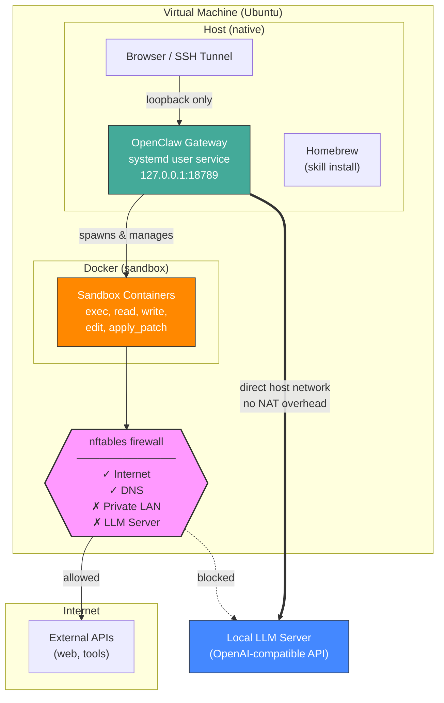

# OpenClaw Secure Gateway – Native NPM Reference Setup

> **Working Document** – This documentation reflects the current behavior of OpenClaw at the time of writing. OpenClaw is under active development; configuration options and recommended practices may change in future versions.

---

## 1. Overview

### Architecture



This document describes a secure and reproducible reference architecture for running OpenClaw **natively via NPM** inside a virtual machine:

- Gateway runs directly on the host (no container overhead for LLM calls)
- Tool execution sandboxed in Docker containers
- Firewall blocks sandbox containers from accessing private LAN networks
- Local LLM integration (e.g. LM Studio or any OpenAI-compatible server)
- Web UI only accessible via localhost
- Optional Telegram integration
- Optional remote access via Cloudflare Tunnel or SSH

### Native NPM vs. Docker Compose: Trade-offs

This guide describes the **Native NPM** approach. For the Docker Compose approach, see the [previous version](https://github.com/jhaertf/openclaw-sandboxed/tree/docker-compose) of this repository.

| Aspect | Docker Compose | Native NPM (this guide) |
|--------|---------------|------------------------|
| Gateway | Runs in container | Runs on host (systemd) |
| LLM latency | ~1.8s first request (bridge NAT) | ~0.3s (direct host network) |
| Sandbox | Separate Docker network | Default bridge + nftables |
| Complexity | docker-compose.yml + volumes | npm install + systemd |
| Upgrades | `docker compose pull` | `npm update -g openclaw` |

**Advantages of Native NPM:**

- **5-6x faster LLM API calls** — no Docker NAT/bridge overhead between gateway and LLM server
- **Simpler setup** — no docker-compose.yml, no volume management, no image builds for the gateway
- **Easier debugging** — gateway logs via `journalctl`, direct access to config files
- **Lower resource usage** — no container overhead for the gateway process itself
- **Simpler firewall** — only one Docker interface (`docker0`) to manage instead of two separate bridge networks

**Advantages of Docker Compose:**

- **Full process isolation** — gateway itself runs in a container, limiting blast radius if compromised
- **Reproducible environment** — pinned image versions guarantee identical behavior across deployments
- **Network segmentation** — separate gateway-net and sandbox-net allow fine-grained firewall rules per network
- **Easier rollback** — `docker compose down && docker compose up` with a previous image tag
- **No host dependencies** — no need to install Node.js, npm, or Homebrew on the host

**Recommendation:** Use **Native NPM** when running a local LLM where latency matters. Use **Docker Compose** when the gateway is cloud-connected (no local LLM) or when full container isolation is a hard requirement.

---

## 2. Virtual Machine Setup (e.g. Proxmox)

Recommended VM settings:

| Setting | Recommendation | Why |
|---------|---------------|-----|
| BIOS | OVMF (UEFI) | Modern virtual hardware |
| Machine Type | q35 | Better device emulation |
| **CPU Type** | **Host** | Exposes real CPU features (AVX, etc.) |
| Guest Agent | Enabled | Better VM management |
| Disk | VirtIO SCSI | Best I/O performance |
| Network | VirtIO | Best network performance |
| OS | Ubuntu Server 24.04 LTS | LTS stability |

> **Important:** Use CPU type `host`, not the default QEMU emulation. The default emulates an older CPU family which lacks modern instruction sets. This matters for Node.js and any local processing.

### Configure Static IP (Netplan)

File: `/etc/netplan/01-netcfg.yaml`

```yaml
network:
  version: 2
  renderer: networkd
  ethernets:
    ens18:
      addresses:
        - <VM_IP>/24
      routes:
        - to: default
          via: <GATEWAY_IP>
      nameservers:
        addresses: [<DNS_IP>]
```

```bash
sudo netplan apply
```

---

## 3. Prepare Ubuntu

```bash
sudo apt update && sudo apt upgrade -y
sudo apt install -y curl ca-certificates gnupg nftables build-essential procps file git
```

---

## 4. Install Node.js

OpenClaw requires Node.js 22+:

```bash
curl -fsSL https://deb.nodesource.com/setup_22.x | sudo -E bash -
sudo apt install -y nodejs
```

---

## 5. Install Docker

Docker is only needed for sandbox containers (tool isolation), not for the gateway itself:

```bash
curl -fsSL https://get.docker.com | sudo sh
sudo usermod -aG docker $USER
newgrp docker
```

Build the sandbox image:

```bash
docker pull debian:bookworm-slim
docker tag debian:bookworm-slim openclaw-sandbox:bookworm-slim
```

---

## 6. Install OpenClaw

```bash
# Create a dedicated user (recommended)
sudo useradd -m -s /bin/bash -G docker openclaw

# Switch to the openclaw user
sudo su - openclaw

# Install OpenClaw globally
npm install -g openclaw

# Run the onboarding wizard
openclaw setup --wizard
```

### Install as systemd User Service

```bash
# As the openclaw user:
openclaw service install
```

This creates a systemd user service at `~/.config/systemd/user/openclaw-gateway.service`.

Manage the service:

```bash
systemctl --user start openclaw-gateway
systemctl --user stop openclaw-gateway
systemctl --user restart openclaw-gateway
systemctl --user status openclaw-gateway
```

Enable auto-start on boot:

```bash
# As root (required for lingering):
sudo loginctl enable-linger openclaw
```

---

## 7. Security Configuration

Edit `~/.openclaw/openclaw.json` and apply these security settings:

### Gateway Binding

```jsonc
{
  "gateway": {
    "bind": "loopback"   // Only listen on 127.0.0.1
  }
}
```

### Network Discovery

```jsonc
{
  "discovery": {
    "mdns": {
      "mode": "off"       // No network broadcast
    }
  }
}
```

### Log Redaction

```jsonc
{
  "logging": {
    "redactSensitive": "tools"  // Redact sensitive data in logs
  }
}
```

### Telegram Channel Security (if enabled)

```jsonc
{
  "channels": {
    "telegram": {
      "dmPolicy": "allowlist",       // Only approved users can DM
      "allowFrom": ["<YOUR_TELEGRAM_USER_ID>"],
      "groupPolicy": "allowlist"
    }
  }
}
```

> **Note:** Only Telegram and WhatsApp support `dmPolicy`. Do **not** add it for Discord or Slack (causes validation errors).

### Tool Sandbox

```jsonc
{
  "agents": {
    "defaults": {
      "sandbox": {
        "mode": "non-main",       // Sandbox non-main sessions (Telegram, groups)
        "scope": "session",       // One container per session
        "workspaceAccess": "rw",  // Read-write workspace access
        "docker": {
          "network": "bridge"     // Default Docker bridge
        }
      }
    }
  },
  "tools": {
    "elevated": {
      "enabled": false            // No sandbox escape possible
    }
  }
}
```

> `mode: "non-main"` means your direct terminal/webchat session runs on the host (full access), while Telegram and other channel sessions run isolated in Docker containers.

### Verify Security

```bash
openclaw security audit --deep
```

Expected result: 0 critical findings.

---

## 8. Firewall (nftables)

This is the most important security layer. It prevents sandbox containers from accessing your private LAN while allowing internet access.

File: `/etc/nftables.conf`

```nft
#!/usr/sbin/nft -f

flush ruleset

table inet oc_sandbox {
  set private_ipv4 {
    type ipv4_addr
    flags interval
    elements = {
      10.0.0.0/8,
      172.16.0.0/12,
      192.168.0.0/16,
      169.254.0.0/16
    }
  }

  chain forward {
    type filter hook forward priority 0; policy accept;

    # Allow Docker-internal traffic
    iifname "docker0" oifname "docker0" accept

    # Allow DNS from sandbox (required for internet access)
    iifname "docker0" tcp dport 53 accept
    iifname "docker0" udp dport 53 accept

    # Block sandbox access to ALL private networks
    iifname "docker0" ip daddr @private_ipv4 drop

    # Allow everything else (internet)
    iifname "docker0" accept
  }
}
```

Apply and enable:

```bash
sudo nft -f /etc/nftables.conf
sudo systemctl enable nftables
```

### Why This Works

Since the gateway runs **natively on the host** (not in Docker), the firewall rules only affect Docker containers (sandbox). The gateway communicates with the LLM server directly via the host network stack — no NAT, no firewall restrictions, no latency penalty.

### Verify Firewall

```bash
# Sandbox -> Internet (should work)
docker run --rm --network bridge curlimages/curl:latest https://example.com

# Sandbox -> LAN (should be BLOCKED)
docker run --rm --network bridge curlimages/curl:latest \
  --connect-timeout 5 http://<LLM_SERVER_IP>:1234 || echo "BLOCKED"

# Host -> LLM (should work)
curl http://<LLM_SERVER_IP>:1234/v1/models
```

---

## 9. Local LLM Configuration

Add a custom provider for your local LLM server in `~/.openclaw/openclaw.json`:

```jsonc
{
  "models": {
    "mode": "merge",
    "providers": {
      "lmstudio": {
        "baseUrl": "http://<LLM_SERVER_IP>:1234/v1",
        "apiKey": "<ANY_KEY>",
        "api": "openai-responses",
        "models": [
          {
            "id": "<model-org>/<model-name>",
            "name": "Your Model Name",
            "reasoning": false,
            "input": ["text"],
            "cost": { "input": 0, "output": 0, "cacheRead": 0, "cacheWrite": 0 },
            "contextWindow": 32768,
            "maxTokens": 2048
          }
        ]
      }
    }
  },
  "agents": {
    "defaults": {
      "model": {
        "primary": "lmstudio/<model-org>/<model-name>",
        "fallbacks": ["<cloud-provider>/<cloud-model>"]
      }
    }
  }
}
```

> **Tip:** Use `"api": "openai-responses"` for better streaming performance compared to `"openai-completions"`.

---

## 10. Homebrew for Skills (Optional)

OpenClaw uses Homebrew to install skills. Since Homebrew refuses to run as root, create a dedicated user:

```bash
# Install dependencies
sudo apt install -y build-essential procps curl file git

# Create linuxbrew user
sudo useradd -m -s /bin/bash linuxbrew

# Install Homebrew
sudo -u linuxbrew NONINTERACTIVE=1 /bin/bash -c \
  "$(curl -fsSL https://raw.githubusercontent.com/Homebrew/install/HEAD/install.sh)"

# Make Homebrew accessible to openclaw user
sudo usermod -aG linuxbrew openclaw
sudo chmod -R g+w /home/linuxbrew/.linuxbrew/
sudo chmod o+rx /home/linuxbrew

# Add to openclaw user's PATH
echo 'eval "$(/home/linuxbrew/.linuxbrew/bin/brew shellenv)"' >> /home/openclaw/.bashrc
```

---

## 11. Remote Access

### Option A: Cloudflare Tunnel (Recommended)

Provides secure HTTPS access without exposing ports:

1. Create tunnel in [Cloudflare Zero Trust Dashboard](https://one.dash.cloudflare.com/)
2. Configure: Service Type `HTTP`, URL `localhost:18789`
3. Install cloudflared:

```bash
curl -fsSL https://github.com/cloudflare/cloudflared/releases/latest/download/cloudflared-linux-amd64.deb \
  -o /tmp/cloudflared.deb
sudo dpkg -i /tmp/cloudflared.deb
sudo cloudflared service install <YOUR_TUNNEL_TOKEN>
```

> **Important:** When using Cloudflare Tunnel, change `gateway.bind` to `"lan"` in `openclaw.json`. The tunnel connects via HTTP internally, so `allowInsecureAuth: true` is also required. This is safe because the port remains bound to the tunnel — not exposed to the network.

### Option B: SSH Tunnel

```bash
ssh -L 18789:127.0.0.1:18789 openclaw@<VM_IP>
```

Access: `http://localhost:18789/?token=<YOUR_TOKEN>`

---

## 12. Operations

| Task | Command |
|------|---------|
| Status | `systemctl --user status openclaw-gateway` |
| Logs | `journalctl --user -u openclaw-gateway -f` |
| Restart | `systemctl --user restart openclaw-gateway` |
| Update | `npm update -g openclaw` |
| Security audit | `openclaw security audit --deep` |
| Sandbox status | `openclaw sandbox explain` |
| Sandbox containers | `openclaw sandbox list` |
| Health check | `openclaw doctor` |

---

## 13. Functional Tests

```bash
# 1. Gateway is listening on localhost only
ss -tlnp | grep 18789
# Expected: 127.0.0.1:18789 and [::1]:18789

# 2. Sandbox -> Internet (should succeed)
docker run --rm --network bridge curlimages/curl:latest https://example.com

# 3. Sandbox -> Private LAN (should fail)
docker run --rm --network bridge curlimages/curl:latest \
  --connect-timeout 5 http://<LLM_SERVER_IP>:1234 || echo "BLOCKED"

# 4. Host -> LLM Server (should succeed)
curl http://<LLM_SERVER_IP>:1234/v1/models

# 5. OpenClaw security audit
openclaw security audit --deep
# Expected: 0 critical
```

---

## 14. Common Issues

| Issue | Cause | Fix |
|-------|-------|-----|
| Sandbox reaches LAN | nftables not loaded | `sudo nft -f /etc/nftables.conf` |
| LLM unreachable | Wrong IP or firewall | Check host can reach LLM: `curl http://<IP>:1234/v1/models` |
| Slow LLM responses | Concurrent requests queue on LLM | Reduce `maxConcurrent` to 1-2 |
| Docker permission denied | User not in docker group | `sudo usermod -aG docker openclaw && newgrp docker` |
| Skill install fails | Homebrew not installed | See Section 10 |
| Telegram 409 Conflict | Same bot token on multiple instances | Only run one instance per bot token |
| `openclaw-gateway` won't start | Port already in use | Check `ss -tlnp \| grep 18789` |

---

## 15. Local LLM Tuning (LM Studio)

See: [Local LLM Tuning](docs/local-llm-tuning.md)

---

## Result

This setup provides:

- Isolated tool execution (Docker sandbox)
- Secure gateway (loopback only, token auth)
- Local LLM with zero NAT latency (native host networking)
- Firewall-enforced LAN isolation for sandboxed tools
- Internet access for tools (APIs, web fetching)
- Optional Telegram integration with allowlist policy
- Optional remote access via Cloudflare Tunnel or SSH
- Reproducible deployment via NPM + systemd

---

**License:** MIT
**Contributions:** Welcome
